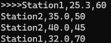
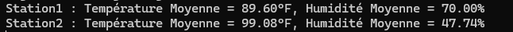

<h1># Projet Kafka Streams - Analyse de Données Météorologiques</h1>

Une entreprise collecte des données météorologiques en temps réel via Kafka. Chaque
station météorologique envoie des messages dans le topic Kafka nommé 'weather-data'. Les
messages ont le format suivant :
station,temperature,humidity
- station : L'identifiant de la station (par exemple, Station1, Station2, etc.).
- temperature : La température mesurée (en °C, par exemple, 25.3).
- humidity : Le pourcentage d'humidité (par exemple, 60).

Vous devez créer une application Kafka Streams pour effectuer les transformations suivantes
:
1. Lire les données météorologiques : Lisez les messages depuis le topic Kafka 'weather-data'
   en utilisant un flux (KStream).
2. Filtrer les données de température élevée
- Ne conservez que les relevés où la température est supérieure à 30°C.
- Exemple :
- Input : Station1,25.3,60 | Station2,35.0,50
- Output : Station2,35.0,50
3. Convertir les températures en Fahrenheit
- Convertissez les températures mesurées en degrés Celsius (°C) en Fahrenheit (°F) avec la
  formule :
  Fahrenheit = (Celsius * 9/5) + 32
- Exemple :
- Input : Station2,35.0,50
- Output : Station2,95.0,50
4. Grouper les données par station
- Regroupez les relevés par station (station).
- Calculez la température moyenne et le taux d'humidité moyen pour chaque station.
- Exemple :

- Input : Station2,95.0,50 | Station2,98.6,40
- Output : Station2,96.8,45
5. Écrire les résultats
   Publiez les résultats agrégés dans un nouveau topic Kafka nommé 'station-averages'.
   Contraintes
- Utilisez les concepts de KStream, KTable, et KGroupedStream.
- Gérer les données en assurant une sérialisation correcte.
- Assurez un arrêt propre de l'application en ajoutant un hook.
  Objectif
  À la fin de l'exercice, votre application Kafka Streams doit :
1. Lire les données météo depuis le topic 'weather-data'.
2. Filtrer et transformer les relevés météorologiques.

3. Publier les moyennes de température et d'humidité par station dans le topic 'station-
   averages'.

   <h2>input/output</h2>
<h3>input</h3>
   
<h3>output</h3>
   